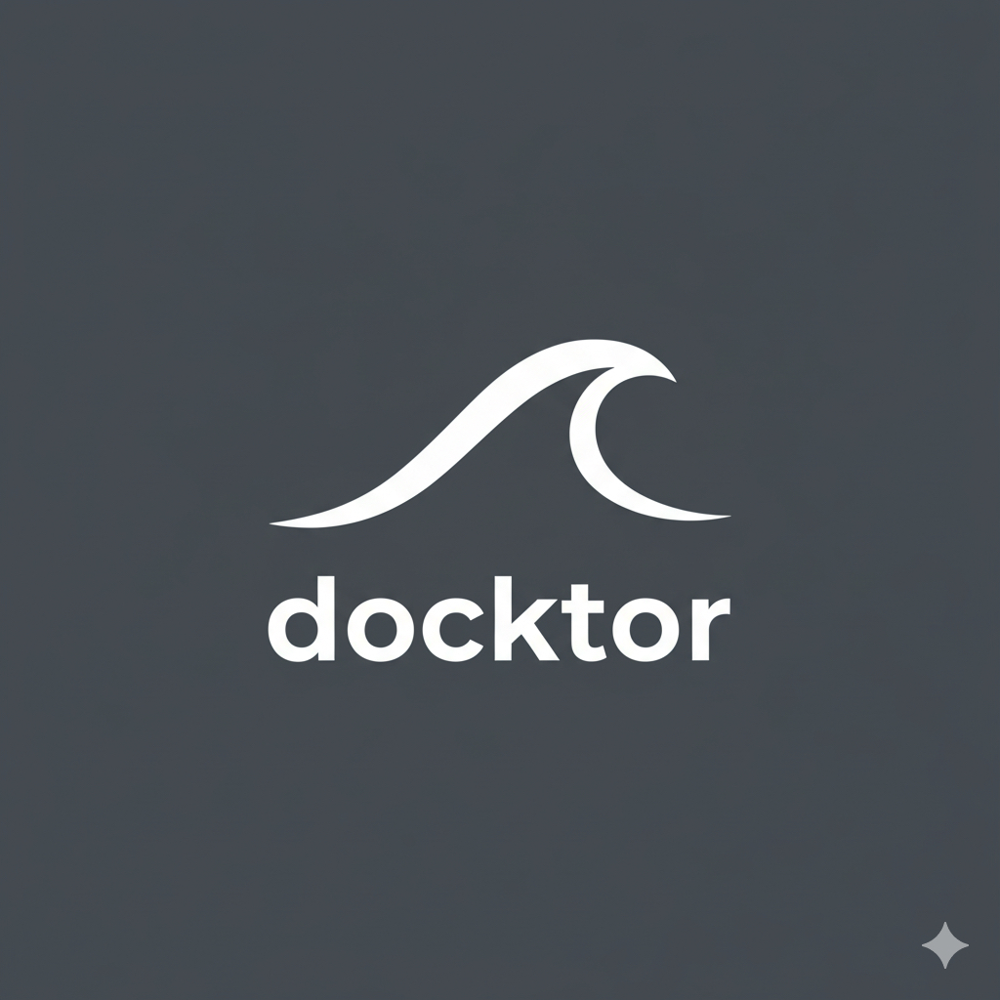

<div align="center">
  
  
  ## AI-Native Autoscaling for Docker

  **Autonomous SRE agent that monitors and scales Docker Compose services using LLMs and MCP.**

  [](https://docs.docker.com/compose/)
  [](https://www.docker.com/products/model-runner/)
  [](https://modelcontextprotocol.io/)
  [](https://github.com/docker/cagent)
</div>

---

## 🚀 Quick Start

**Prerequisites**: Docker Desktop + Model Runner, cagent, Go 1.21+ (see [Installation](#installation))

### Autonomous Daemon Mode (Recommended)

For fully autonomous 24/7 operation - no user intervention required:

```bash
# 1. Clone and build
git clone https://github.com/hwclass/docktor
cd docktor
go build -o docktor ./cmd/docktor

# 2. Start autonomous daemon (auto-scales automatically)
./docktor daemon start

# 3. Generate load to trigger scaling (in another terminal)
# Option A: Incremental load simulator (recommended for demos)
bash examples/single-service/load-incremental.sh

# Option B: Quick test - instant high load (90 seconds)
bash examples/single-service/load-quick.sh

# 4. Monitor daemon in real-time
./docktor daemon logs

# 5. Check status
./docktor daemon status

# 6. Stop daemon when done
./docktor daemon stop
```

**Advanced Options:**
```bash
# Custom compose file and service
./docktor daemon start --compose-file ./production.yaml --service api

# Manual mode (requires approval for each action)
./docktor daemon start --manual
```

### Interactive Mode (For Learning)

For interactive exploration with chat interface - user intervention required:

```bash
# 1. Run Docktor (opens cagent TUI)
./docktor ai up

# 2. In the TUI, send a message to start autoscaling:
# Type: "Start autoscaling web service now"

# 3. Generate load (in another terminal)
bash examples/load-cpu.sh

# 4. Watch containers scale
bash examples/watch.sh
```

**Mode Comparison:**
- **Daemon (Recommended)**: Fully autonomous, runs in background, no user input needed
- **Interactive**: Manual chat interface, good for learning how decisions are made

📖 **Full testing guide**: See [AUTOSCALE_GUIDE.md](AUTOSCALE_GUIDE.md)

---

## ⚙️ Configuration

Docktor uses `docktor.yaml` for per-app scaling configuration. This allows customizing thresholds without code changes.

### Example Configuration

```yaml
# docktor.yaml
version: "1"

service: web
compose_file: docker-compose.yaml

scaling:
  cpu_high: 75.0        # Scale up when CPU >= 75%
  cpu_low: 20.0         # Scale down when CPU <= 20%

  min_replicas: 2       # Never scale below 2 (HA)
  max_replicas: 10      # Never scale above 10 (capacity)

  scale_up_by: 2        # Add 2 replicas when scaling up
  scale_down_by: 1      # Remove 1 replica when scaling down

  check_interval: 10    # Check every 10 seconds
  metrics_window: 10    # Average metrics over 10 seconds
```

### Using Configuration

```bash
# Use default docktor.yaml
./docktor daemon start

# Use custom config
./docktor daemon start --config my-app.yaml

# Override specific values
./docktor daemon start --config prod.yaml --service api
```

### Configuration Fields

| Field | Type | Default | Description |
|-------|------|---------|-------------|
| `service` | string | `web` | Docker Compose service name to monitor |
| `compose_file` | string | `examples/docker-compose.yaml` | Path to compose file |
| `scaling.cpu_high` | float | `75.0` | CPU % threshold to trigger scale-up |
| `scaling.cpu_low` | float | `20.0` | CPU % threshold to trigger scale-down |
| `scaling.min_replicas` | int | `2` | Minimum replicas (high availability) |
| `scaling.max_replicas` | int | `10` | Maximum replicas (cost/capacity limit) |
| `scaling.scale_up_by` | int | `2` | Replicas to add when scaling up |
| `scaling.scale_down_by` | int | `1` | Replicas to remove when scaling down |
| `scaling.check_interval` | int | `10` | Seconds between autoscaling checks |
| `scaling.metrics_window` | int | `10` | Seconds to collect and average metrics |

###  Multi-Service & Queue-Aware Scaling

Docktor supports monitoring multiple services simultaneously with queue-aware autoscaling (NATS JetStream, RabbitMQ, Kafka coming soon).

#### Multi-Service Configuration

```yaml
# docktor.yaml
version: "1"
compose_file: docker-compose.yaml

# Monitor multiple services with different configs
services:
  - name: web
    min_replicas: 2
    max_replicas: 10
    check_interval: 10
    metrics_window: 10
    rules:
      scale_up_when:
        - metric: cpu.avg
          op: ">"
          value: 75.0
      scale_down_when:
        - metric: cpu.avg
          op: "<"
          value: 20.0

  - name: consumer
    min_replicas: 1
    max_replicas: 20
    check_interval: 10
    metrics_window: 10
    rules:
      scale_up_when:
        # OR logic: scale if ANY condition matches
        - metric: queue.backlog
          op: ">"
          value: 500
        - metric: queue.rate_in
          op: ">"
          value: 200
      scale_down_when:
        # AND logic: scale only if ALL conditions match
        - metric: queue.backlog
          op: "<="
          value: 100
        - metric: queue.rate_in
          op: "<"
          value: 150
    queue:
      kind: nats
      url: nats://nats:4222
      jetstream: true
      stream: EVENTS
      consumer: WEB_WORKERS
      subject: events.web
```

#### Available Metrics

**CPU Metrics** (always available):
- `cpu.avg` - Average CPU across all containers
- `cpu.min` - Minimum CPU
- `cpu.max` - Maximum CPU

**Queue Metrics** (when queue configured):
- `queue.backlog` - Pending messages for consumer
- `queue.lag` - Messages between stream head and consumer
- `queue.rate_in` - Incoming message rate (msgs/sec)
- `queue.rate_out` - Processing rate (msgs/sec)

#### Scaling Logic

**Scale-up rules**: OR logic - scale if **any** condition matches
**Scale-down rules**: AND logic - scale only if **all** conditions match

This prevents premature scale-down while allowing quick scale-up response.

#### Example: NATS JetStream Queue Scaling

```bash
# Run the complete NATS example
cd examples/multi-service/nats-queue
docker compose up -d
cd ../../..
./docktor daemon start --config examples/multi-service/nats-queue/docktor.yaml

# Monitor scaling decisions
./docktor explain --tail 20

# Validate configuration
./docktor config validate
```

📖 **Full NATS example**: See [examples/multi-service/nats-queue/README.md](examples/multi-service/nats-queue/README.md)

#### Queue Plugin Architecture

Docktor uses an extensible plugin system for queue backends. Current and planned support:

| Queue System | Status | Metrics Available | Plugin Location |
|-------------|--------|-------------------|-----------------|
| **NATS JetStream** | ✅ **Available** | backlog, lag, rate_in, rate_out | [pkg/queue/nats.go](pkg/queue/nats.go) |
| **RabbitMQ** | 🔜 Planned | queue depth, consumer count, rates | Coming soon |
| **Apache Kafka** | 🔜 Planned | consumer lag, partition offset | Coming soon |
| **Redis Streams** | 🔜 Planned | pending entries, consumer group lag | Coming soon |
| **AWS SQS** | 🔜 Planned | messages available, in-flight | Coming soon |

**Adding New Queue Backends:**

The plugin interface is defined in [pkg/queue/queue.go](pkg/queue/queue.go):

```go
type Provider interface {
    Connect() error
    GetMetrics(windowSec int) (*Metrics, error)
    Validate() error
    Close() error
}
```

To add a new queue backend:
1. Implement the `Provider` interface
2. Register via `queue.Register("yourqueue", NewYourQueueProvider)` in `init()`
3. Add configuration in `docktor.yaml` with `kind: yourqueue`

See [pkg/queue/nats.go](pkg/queue/nats.go) as a reference implementation.

---

📚 **See [AGENTS.md](AGENTS.md)** for agent instruction details and the [agents.md](https://agents.md/) specification.

---

## 🤖 LLM Model Selection

Docktor supports switching between different LLM models for autoscaling decisions. Choose the model that best fits your needs - from lightweight local models to powerful cloud LLMs.

### Quick Start

```bash
# List available models from Docker Model Runner
./docktor config list-models

# Switch to a specific model
./docktor config set-model ai/granite-4.0-h-micro

# Switch to OpenAI
./docktor config set-model gpt-4o-mini --provider=openai --base-url=https://api.openai.com/v1
# Then set: export OPENAI_API_KEY=sk-...

# Start daemon with selected model
./docktor daemon start
```

### Model Providers

**Docker Model Runner (DMR) - Recommended for Local**
- ✅ Completely free and private
- ✅ No API keys required
- ✅ Works offline
- Available models: Llama 3.2, IBM Granite, Phi-3, SmolLM2, and more

**OpenAI-Compatible Providers**
- OpenAI (GPT-4, GPT-4o-mini)
- Anthropic Claude (via proxy)
- Azure OpenAI
- Any OpenAI-compatible endpoint

### Configuration

The LLM configuration is stored in `docktor.yaml`:

```yaml
llm:
  provider: dmr                                          # "dmr" or "openai"
  base_url: "http://localhost:12434/engines/llama.cpp/v1"  # API endpoint
  model: "ai/llama3.2"                                   # Model ID

# For OpenAI or compatible providers:
# llm:
#   provider: openai
#   base_url: "https://api.openai.com/v1"
#   model: "gpt-4o-mini"
# Then: export OPENAI_API_KEY=sk-...
```

### Decision Provenance

Every autoscaling decision includes metadata showing which model made it:

```json
{
  "timestamp": "2024-03-15T10:30:45Z",
  "iteration": 42,
  "avg_cpu": 87.3,
  "action": "scale_up",
  "current_replicas": 2,
  "target_replicas": 4,
  "reason": "CPU high at 87.3%",
  "metadata": {
    "provider": "dmr",
    "model": "ai/granite-4.0-h-micro"
  }
}
```

This allows you to:
- Compare decision quality across different models
- Audit which model was active during incidents
- Benchmark model performance for your workload

### Example: Switching Models

```bash
# Test with Llama 3.2 (fast, lightweight)
./docktor config set-model ai/llama3.2
./docktor daemon start
# ... observe scaling behavior ...
./docktor daemon stop

# Test with IBM Granite (enterprise-grade)
./docktor config set-model ai/granite-4.0-h-micro
./docktor daemon start
# ... compare decision quality ...
./docktor daemon stop

# Compare logs to see which model performed better
grep '"metadata"' /tmp/docktor-daemon.log | jq '.metadata.model' | sort | uniq -c
```

### ⚠️ Known Limitations

**Llama 3.2 (3B) Model Constraints:**

When using Docker Model Runner with Llama 3.2 (3.21B parameters), you may experience:
- Inconsistent constraint enforcement (may violate `min_replicas`)
- Type conversion issues (numbers → strings in tool calls)
- Incomplete autonomous loops (stops after initial iterations)

**Recommended for Production:**
```bash
# Option 1: Use Cloud LLMs (more reliable)
# Create .env.cagent:
OPENAI_BASE_URL=https://api.openai.com/v1
OPENAI_API_KEY=sk-...
OPENAI_MODEL=gpt-4  # or gpt-4-turbo, claude-3-opus

# Option 2: Larger local models via Docker Model Runner
# Use Llama 3.1 (70B) or Qwen 2.5 (32B) for better reliability
```

✅ **Llama 3.2 works for demos and testing**
🚀 **Use GPT-4 or Claude for production workloads**

---

## What is Docktor?

Docktor is an **AI-powered autoscaling system** that uses **local LLMs** to make intelligent scaling decisions for Docker Compose services.

### Key Features

- 🤖 **AI-Native**: Uses Llama 3.2 (3B) via Docker Model Runner for decision-making
- 📊 **Dynamic Scaling**: Agent calculates optimal replica counts (not hardcoded)
- 🔍 **Explainable**: Full MCP audit trail of every decision
- 🏠 **Completely Local**: No API keys, no cloud dependencies
- 🐳 **Docker-Native**: Works with standard Compose files

### How It Works

```
Every ~60 seconds:
1. get_metrics       → Collect CPU% from all 'web' containers
2. analyze           → LLM calculates average, counts replicas
3. decide            → If CPU > 80%: scale up (+2)
                       If CPU < 20%: scale down (-1)
                       Else: hold steady
4. apply_scale       → Execute docker compose --scale web=N
```

All actions are logged via MCP for full observability.

---

## Architecture

```
┌─────────────────────────────────────────────────────────┐
│                    DOCKER DESKTOP                       │
│                                                         │
│  ┌────────────────┐         ┌──────────────┐          │
│  │ Model Runner   │────────▶│ Llama 3.2 3B │          │
│  │  (llama.cpp)   │         │  (local LLM) │          │
│  └────────────────┘         └──────┬───────┘          │
│                                     │                   │
│                          ┌──────────▼────────┐         │
│                          │      cagent       │         │
│                          │   (AI Agent)      │         │
│                          └──────────┬────────┘         │
│                                     │                   │
│                                     │ MCP (JSON-RPC)    │
│                                     ▼                   │
│                          ┌─────────────────┐           │
│                          │ Docktor MCP     │           │
│                          │ • get_metrics   │           │
│                          │ • detect_anomaly│           │
│                          │ • propose_scale │           │
│                          │ • apply_scale   │           │
│                          └────────┬────────┘           │
│                                   │                     │
│                                   ▼                     │
│                          ┌─────────────────┐           │
│                          │ Docker Compose  │           │
│                          │  web: ×1-10     │           │
│                          │  lb: ×1         │           │
│                          │  redis: ×1      │           │
│                          └─────────────────┘           │
└─────────────────────────────────────────────────────────┘
```

---

## Installation

### Prerequisites

1. **Docker Desktop** with Model Runner enabled (comes bundled)
2. **cagent** CLI:
   ```bash
   # macOS
   brew install cagent

   # Linux
   # See: https://github.com/docker/cagent
   ```

3. **Go 1.21+**:
   ```bash
   brew install go
   ```

### Build

```bash
git clone https://github.com/hwclass/docktor
cd docktor
go build -o docktor ./cmd/docktor
```

### Configuration (Optional)

For cloud LLMs or custom model settings:

```bash
cp .env.cagent.example .env.cagent
# Edit .env.cagent with your API keys and model preferences
```

**Note**: If using Docker Model Runner (recommended), `.env.cagent` will be auto-created on first run.

---

## Directory Structure

```
docktor/
├── cmd/
│   └── docktor/
│       └── main.go             # MCP server with 4 tools
├── agents/
│   ├── docktor.dmr.yaml        # Agent config for Docker Model Runner
│   └── docktor.cloud.yaml      # Agent config for cloud LLMs
├── scripts/
│   ├── daemon.sh               # Daemon launcher (start/stop/status)
│   ├── load-cpu.sh             # CPU load generator for testing
│   ├── mcp-debug.sh            # MCP logging wrapper
│   └── watch.sh                # Container monitoring helper
├── examples/
│   └── docker-compose.yaml     # Demo stack (nginx lb + redis + web)
├── .env.cagent.example         # Example environment configuration
├── .gitignore                  # Git ignore rules
├── README.md                   # This file
├── AUTOSCALE_GUIDE.md          # Detailed testing guide
└── STATUS.md                   # Technical status and learnings
```

---

## Usage Examples

### Example 1: Low CPU → Scale Down

```
Calling get_metrics(container_regex: "web", window_sec: 30)
→ {"examples-web-1": 0.5, "examples-web-2": 0.3, "examples-web-3": 0.1}

Agent analyzes:
  - Current replicas: 3
  - Average CPU: 0.3%
  - Decision: avg < 20%, scale down

Calling apply_scale(service: "web", target_replicas: 2, reason: "CPU low at 0.3%")
→ SUCCESS: scaled web from 3 to 2
```

### Example 2: High CPU → Scale Up

```
Calling get_metrics(container_regex: "web", window_sec: 30)
→ {"examples-web-1": 87.2, "examples-web-2": 91.5}

Agent analyzes:
  - Current replicas: 2
  - Average CPU: 89.3%
  - Decision: avg > 80%, scale up

Calling apply_scale(service: "web", target_replicas: 4, reason: "CPU high at 89.3%")
→ SUCCESS: scaled web from 2 to 4
```

### Example 3: Healthy Range → Hold

```
Calling get_metrics(container_regex: "web", window_sec: 30)
→ {"examples-web-1": 45.2, "examples-web-2": 52.1}

Agent analyzes:
  - Current replicas: 2
  - Average CPU: 48.6%
  - Decision: 20% < avg < 80%, healthy range

No action taken, CPU is optimal.
```

---

## Configuration

### Agent Files

Docktor automatically selects the appropriate agent configuration:

- **`agents/docktor.dmr.yaml`** - Used when Docker Model Runner is detected
  - Model: `dmr/ai/llama3.2` (hardcoded, optimized for local use)

- **`agents/docktor.cloud.yaml`** - Used when DMR is not available
  - Model: Reads from `OPENAI_MODEL` in `.env.cagent`

### Scaling Thresholds

Edit either agent file to adjust thresholds:

```yaml
agents:
  docktor:
    instruction: |
      # Adjust these values:
      - If avg CPU > 80%: scale up (+2 replicas)
      - If avg CPU < 25%: scale down (-1 replica, min 1)
      - If 25-80%: healthy, no change
```

### Model Selection

**Using Docker Model Runner (Local)**
```bash
# List available models
./docktor config list-models

# Switch to any available model
./docktor config set-model ai/llama3.2
./docktor config set-model ai/granite-4.0-h-micro
./docktor config set-model ai/smollm2

# Start daemon with selected model
./docktor daemon start
```

**Using Cloud LLMs**
```bash
# Switch to OpenAI
./docktor config set-model gpt-4o-mini --provider=openai --base-url=https://api.openai.com/v1

# Set API key
export OPENAI_API_KEY=sk-your-key-here

# Start daemon
./docktor daemon start
```

See the [LLM Model Selection](#-llm-model-selection) section for full details.

### Monitoring Window

The agent uses a 10-second rolling window for CPU metrics. This is configured in the instruction via `window_sec: 10`.

### Compose File

Point to your own Compose file:

```bash
export DOCKTOR_COMPOSE_FILE=/path/to/your/docker-compose.yaml
bash scripts/daemon.sh start
```

---

## Monitoring & Debugging

```bash
# Check if daemon is running
bash scripts/daemon.sh status

# View agent logs in real-time
bash scripts/daemon.sh logs

# See MCP protocol messages
tail -f /tmp/docktor-mcp-debug.log

# Watch container CPU usage
docker stats --no-stream | grep web

# See recent scaling decisions
grep "apply_scale" /tmp/docktor-daemon.log | tail -5

# Monitor container count
watch -n 2 'docker compose -f examples/docker-compose.yaml ps | grep web'
```

---

## Key Achievements

✅ **Dynamic Decision Making**: Agent calculates replica counts based on actual metrics (not hardcoded)
✅ **Local AI**: Runs completely locally with Docker Model Runner
✅ **MCP Explainability**: Full audit trail of all decisions
✅ **Multi-step Tool Orchestration**: Successfully chains get_metrics → analyze → apply_scale
✅ **Continuous Operation**: Daemon loops automatically

---

## Known Limitations

1. **Single Iteration per Daemon Launch**: Due to cagent architecture, the agent completes one full iteration then exits. Restart to run another cycle.
2. **CPU Metrics Only**: Currently only monitors CPU%. Memory/network support planned.
3. **Single Service**: Only scales one service ('web'). Multi-service support planned.

See [STATUS.md](STATUS.md:1) for detailed technical analysis.

---

## Troubleshooting

**Agent exits after one iteration:**
- Expected behavior with current cagent version
- The iteration completes successfully (metrics → decision → scaling)
- Restart with `bash scripts/daemon.sh start` for another cycle

**Model download is slow:**
- Llama 3.2 is 2GB, first download takes ~5 minutes
- Subsequent runs are instant (cached locally)
- Check progress: `docker model ls`

**No scaling happens:**
- Verify containers are actually under load: `docker stats`
- Check MCP logs for errors: `tail /tmp/docktor-mcp-debug.log`
- Ensure Docker Desktop and Model Runner are running

---

## Development

### Run MCP Server Standalone

```bash
./docktor mcp
```

Send JSON-RPC requests via stdin:

```bash
echo '{"jsonrpc":"2.0","id":1,"method":"tools/list","params":{}}' | ./docktor mcp
```

### Test Individual Tools

```bash
# Get metrics
echo '{"jsonrpc":"2.0","id":2,"method":"tools/call","params":{"name":"get_metrics","arguments":{"container_regex":"web","window_sec":30}}}' | ./docktor mcp

# Detect anomalies
echo '{"jsonrpc":"2.0","id":3,"method":"tools/call","params":{"name":"detect_anomalies","arguments":{"metrics":{"web-1":85,"web-2":90},"rules":{"cpu_high_pct":80,"cpu_low_pct":20}}}}' | ./docktor mcp
```

### Modify Agent Behavior

1. Edit the appropriate agent file:
   - [agents/docktor.dmr.yaml](agents/docktor.dmr.yaml:1) - for Docker Model Runner
   - [agents/docktor.cloud.yaml](agents/docktor.cloud.yaml:1) - for cloud LLMs
2. Adjust thresholds or scaling logic in the `instruction` section
3. Restart: `./docktor ai up` or `bash scripts/daemon.sh restart`

---

## Roadmap

### Cloud LLM Providers

- [x] **OpenAI (GPT-4, GPT-3.5)** - Ready to use via `.env.cagent`
- [x] **OpenAI-Compatible Gateways** - Any OpenAI-compatible API (LiteLLM, Ollama with OpenAI mode, etc.)
- [ ] **Anthropic Claude** - Requires cagent support for Anthropic API format
- [ ] **Google Gemini** - Requires cagent support for Google API format
- [ ] **Azure OpenAI** - Should work via OpenAI-compatible endpoint (needs testing)
- [ ] **AWS Bedrock** - Requires cagent support for Bedrock API format

### Core Features
- [x] **Autonomous Daemon**: True continuous operation without user interaction
  - `bash scripts/daemon.sh start` - Runs autonomously (default, auto-approves actions)
  - `bash scripts/daemon.sh start --manual` - Runs with user approval required
  - Monitors every 10 seconds and scales automatically based on CPU thresholds
- [ ] **Multi-Service Scaling**: Scale multiple services simultaneously
- [ ] **Memory/Network Metrics**: Beyond just CPU%
- [x] **Selectable LLM Models**: Choose which model to use via CLI
  - ✅ List available models: `./docktor config list-models`
  - ✅ Switch models: `./docktor config set-model ai/granite-4.0-h-micro`
  - ✅ Support all Docker Model Runner models (Llama, Granite, Phi-3, Gemma, etc.)
  - ✅ Support OpenAI-compatible providers (OpenAI, Anthropic via proxies, etc.)
  - ✅ Per-app configs via `docktor.yaml`
  - ✅ Decision provenance: metadata tracks which model made each scaling decision
  - [ ] Model profiles: "fast" (3B), "balanced" (8B), "smart" (70B)
  - [ ] Auto-fallback if model unavailable
- [ ] **Predictive Scaling**: ML-based load forecasting
- [ ] **Cost Optimization**: Prefer fewer large vs many small replicas

### Notifications & Alerting 🔔

**Real-time notifications for scaling events and anomalies:**

- [ ] **Slack Integration**
  - Post scaling decisions to Slack channels
  - Example: "🔼 Scaled 'web' from 2 → 5 replicas (CPU: 87%, threshold: 80%)"
  - Rich formatting with metrics, reason, and timestamp
  - Thread replies for follow-up context
  - Alert severity levels: INFO (scale events), WARN (high CPU), ERROR (scale failures)

- [ ] **Email Notifications**
  - SMTP integration for email alerts
  - Digest mode: Hourly/daily summaries of scaling activity
  - Immediate alerts: Critical events (repeated scaling, failures)
  - HTML emails with charts and metrics

- [ ] **Webhook Support**
  - Generic webhook endpoint for custom integrations
  - POST scaling events to any URL (Discord, Teams, PagerDuty, etc.)
  - Configurable payload templates
  - Example: `POST https://your-webhook.com/docktor` with JSON payload

- [ ] **PagerDuty Integration**
  - Create incidents for critical scaling events
  - Auto-resolve when situation normalizes
  - Escalation policies for repeated failures

- [ ] **Notification Rules Engine**
  - Configure when to notify: `notify_on: ["scale_up", "scale_down", "failure"]`
  - Threshold-based alerts: "Notify if scaled more than 3 times in 10 minutes"
  - Quiet hours: Suppress non-critical notifications during off-hours
  - Per-service notification preferences

**Configuration Example:**
```yaml
notifications:
  slack:
    webhook_url: https://hooks.slack.com/services/YOUR/WEBHOOK/URL
    channel: "#ops-alerts"
    notify_on: ["scale_up", "scale_down", "failure"]
  email:
    smtp_host: smtp.gmail.com
    smtp_port: 587
    from: docktor@yourcompany.com
    to: ["ops-team@yourcompany.com"]
    digest_mode: hourly
  webhook:
    url: https://your-webhook.com/docktor
    headers:
      Authorization: "Bearer YOUR_TOKEN"
```

### Interactive Control 🎯

**Phase 1: Terminal Interface**
- [ ] **WebSocket/HTTP Prompt Server**: Backend service to receive user prompts in real-time
  - REST API endpoint: `POST /prompt` for sending commands
  - WebSocket for bidirectional communication
  - Prompt queue that agent reads during decision loop
- [ ] **Dynamic Instruction Modification**: Agent reads prompts and adjusts behavior
  - Prompts influence thresholds: "Be conservative" → 90% instead of 80%
  - Temporary overrides: "Hold scaling for 10 min" → skip apply_scale
  - Direct commands: "Scale to 3 now" → immediate action
- [ ] **Terminal Chat Interface**: Simple CLI for interacting with Docktor
  - `docktor chat` command opens interactive terminal session
  - Send prompts: "Why did you scale down?"
  - Get responses: Agent explains decision with metrics
  - Command examples:
    ```bash
    docktor chat
    > Hold off on scaling for 10 minutes, running tests
    > Why did you scale to 4 replicas?
    > Be more aggressive with scaling today
    ```

**Phase 2: Web Interface**
- [ ] **Local Web UI**: Browser-based chat interface running on localhost
  - React/Vue frontend with real-time chat
  - Live metrics dashboard showing CPU, replicas, decisions
  - Visual timeline of scaling events
  - Chat panel for natural language commands
  - Example: `http://localhost:3000` → Docktor Control Panel
- [ ] **Decision Review Mode**: Visual approval workflow before scaling
  - Agent proposes: "Scale from 2 → 5 (CPU at 87%)"
  - User clicks: [Approve] [Reject] [Modify]
  - Learning from patterns: remembers approvals/rejections

**Phase 3: Intelligence**
- [ ] **RAG with Historical Decision Memory**: Learn from past scaling decisions
  - **DuckDB + VSS Plugin**: Store all decisions with vector embeddings
  - Query similar past situations: "What happened last time CPU was 85%?"
  - Pattern recognition: "Monday mornings always need 6+ replicas"
  - Context-aware decisions: "Similar load last week, scaling to 5 worked well"
  - Explainable AI: "I scaled up because 3 similar cases showed performance issues"
  - Database schema:
    ```sql
    CREATE TABLE decisions (
      timestamp TIMESTAMP,
      metrics JSON,           -- CPU, memory, replicas at decision time
      action VARCHAR,         -- scale_up, scale_down, hold
      from_replicas INT,
      to_replicas INT,
      reason TEXT,
      outcome TEXT,           -- success, rolled_back, user_overridden
      embedding FLOAT[384]    -- Vector for similarity search
    );
    ```
  - Chat UI integration: "Show me why you made this decision" → Vector search past similar cases
- [ ] **Learning from Feedback**: Agent remembers user preferences
  - Track which decisions user overrides
  - Adjust future behavior based on patterns
  - "User always prefers conservative scaling on Fridays"
- [ ] **Natural Language Policies**: Define rules in plain English
  - "Never scale below 2 during business hours (9am-5pm)"
  - "Prefer scaling up over performance degradation"
  - "Maximum 8 replicas regardless of load"
  - Policies stored and enforced automatically

### Integration & Observability
- [ ] **Docker Desktop Extension**: Visual dashboard with interactive controls
- [ ] **Web UI**: Browser-based control panel with real-time chat
- [ ] **Prometheus Export**: Metrics for monitoring systems
- [ ] **Alert Integration**: Slack/Discord notifications and commands
- [ ] **Webhook Support**: Trigger scaling from external events

---

## Contributing

Contributions welcome! Areas to help:

1. **Agent Improvements**: Help make cagent daemon mode more stable
2. **Additional Metrics**: Memory, network, custom metrics
3. **Better Formulas**: Smarter scaling calculations
4. **Documentation**: Tutorials, examples, use cases
5. **Testing**: More load scenarios, edge cases

---

## License

MIT License - See [LICENSE](LICENSE) file

---

## Credits

Built with:
- [Docker Model Runner](https://www.docker.com/products/model-runner/) - Local LLM inference
- [cagent](https://github.com/docker/cagent) - Docker's AI agent framework
- [MCP](https://modelcontextprotocol.io/) - Model Context Protocol
- [Llama 3.2](https://ai.meta.com/llama/) - Meta's 3B parameter model
- [Docker Compose](https://docs.docker.com/compose/) - Container orchestration

---

**Docktor** - Because your containers deserve an AI doctor 🩺🤖
